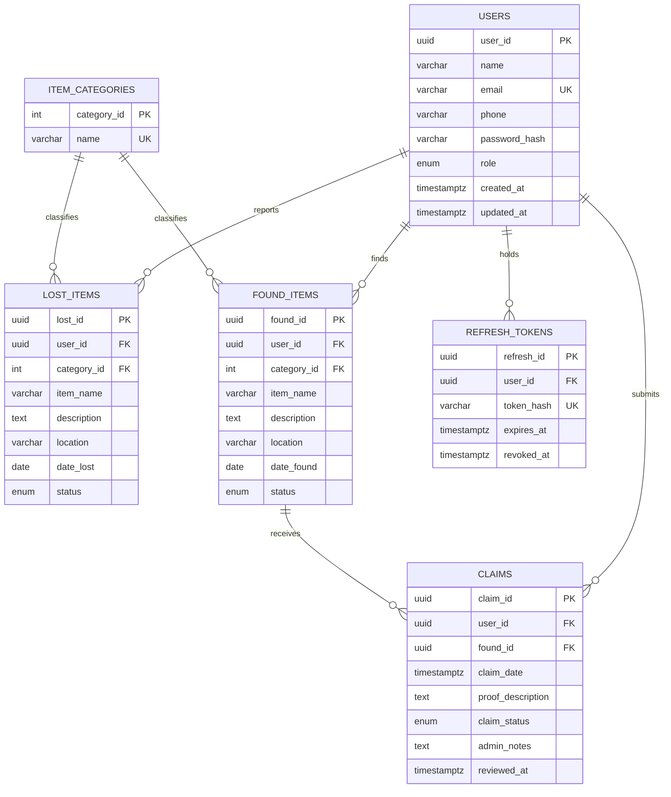

# Lost & Found Management System — Capstone Project Report

**Course:** Database Management Systems (2501IT05) · **Department:** Data Science
**Project:** Campus Lost & Found Management System — a DBMS capstone with a working web prototype
**Repository:** https://github.com/sandilya-bit/lost-and-found
**Live demo:** https://sandilya-bit.github.io/lost-and-found/ (demo sign-in: `demo@lostfound.io` / `Demo@1234`)

---

## 1. Title, objectives & problem statement

**Problem.** Campus lost-and-found handling runs on paper registers and notice
boards: reports get lost, owners cannot search, and there is no auditable chain
from "found" to "returned".

**Objective.** A centralized portal where students report lost/found items,
search a shared database, and submit ownership claims that administrators
verify — with full referential integrity enforced by the database itself.

**Scope.** Six entities (users, item_categories, lost_items, found_items,
claims, refresh_tokens) covering account management, item reporting, claim
review, and session security.

## 2. Entities & attributes (6)

| Entity | Key attributes |
|---|---|
| **users** | user_id (PK), name, email (UQ), phone, password_hash, role, created_at, updated_at |
| **item_categories** | category_id (PK), name (UQ) |
| **lost_items** | lost_id (PK), user_id (FK), category_id (FK), item_name, description, location, date_lost, image_url, status, timestamps |
| **found_items** | found_id (PK), user_id (FK), category_id (FK), item_name, description, location, date_found, image_url, status, timestamps |
| **claims** | claim_id (PK), user_id (FK), found_id (FK), claim_date, proof_description, claim_status, admin_notes, reviewed_at |
| **refresh_tokens** | refresh_id (PK), user_id (FK), token_hash (UQ), user_agent, expires_at, revoked_at |

## 3. ER diagram



Cardinalities: one user → many items/claims/tokens (1:N); one category → many
items (1:N); one found item → many claims (1:N, but a user may claim a given
item only once — enforced by `UNIQUE(user_id, found_id)`).

## 4. Relational schema, primary & foreign keys

```
users (user_id PK, name, email UNIQUE, phone, password_hash, role,
       created_at, updated_at)

item_categories (category_id PK, name UNIQUE)

lost_items (lost_id PK, user_id FK→users, category_id FK→item_categories,
            item_name, description, location, date_lost, image_url,
            status, created_at, updated_at)

found_items (found_id PK, user_id FK→users, category_id FK→item_categories,
             item_name, description, location, date_found, image_url,
             status, created_at, updated_at)

claims (claim_id PK, user_id FK→users, found_id FK→found_items,
        claim_date, proof_description, claim_status, admin_notes,
        reviewed_at, UNIQUE(user_id, found_id))

refresh_tokens (refresh_id PK, user_id FK→users, token_hash UNIQUE,
                user_agent, expires_at, revoked_at, created_at)
```

**Referential actions:** user/item deletes CASCADE to dependents; category
deletes are RESTRICTed (an in-use category cannot be orphaned).

## 5. Database implementation (Review-II deliverables)

Everything lives in [`database/`](../database/) and runs in ~10 minutes:

| Requirement | Where | What to show |
|---|---|---|
| Create database & tables with constraints | `database/schema.sql` | 6 tables, 3 enums, PK/FK/CHECK/UNIQUE, 16 indexes, 4 triggers, 2 functions, 3 views |
| Insert sample data into all tables | `database/seed.sql` | 8 users, 20 lost, 20 found, 3 claims, 2 sessions + verification count query |
| DDL, DML and DQL operations | `database/queries.sql` | UPDATE approvals, insert+delete demo, 6 SELECT families |
| CRUD + joins, aggregates, views | `database/queries.sql` | INNER/LEFT/FULL OUTER joins, correlated subqueries, `FILTER`, GROUP BY/HAVING, views, stored function |
| Data integrity & validation | `database/queries.sql` §D | 7 self-logging demos: UNIQUE, CHECK, FK, cascade, trigger blocks |
| Working database demo | this repo | Live app (mock API mirrors the same model) + SQL walkthrough |

Run guide with commands: [`database/README.md`](../database/README.md).

## 6. Query highlights (with app feature map)

| Query | SQL feature | Powers |
|---|---|---|
| B1 browse feed | 3-table INNER JOIN | Browse page listings |
| B2 category volume | FULL OUTER JOIN + two GROUP BYs | Stat cards on home page |
| B3 found-without-lost | LEFT JOIN + HAVING | Category gap insight |
| B4 top finders | Correlated subquery + COUNT DISTINCT | Leaderboard idea / admin insight |
| B5 fuzzy match | pg_trgm `%` similarity + GIN index | Search box on browse page |
| B6 monthly recovery | DATE_TRUNC + FILTER + ROUND | "recovery rate" home-page metric |
| C1–C4 views | Views + stored function | The API's read layer |

## 7. Application implementation

The React SPA (`frontend/`) is a **self-contained working prototype**: an
in-browser mock API (`frontend/src/api/client.ts` + `mockData.ts`) implements
the same entities, constraints (duplicate email, one-claim-per-item, ≥20-char
proof, role checks) and endpoints the SQL model defines — so the demo works
anywhere, instantly, while `database/` is the production-grade SQL twin.
24-check smoke test: `npm run test:mock` in `frontend/`.

## 8. Screenshots to attach before the review

1. Home page (stats + recently found, signed out)
2. Browse page with filters open (lost tab)
3. Item detail for a found item + claim form
4. Dashboard with My Lost / My Found / My Claims
5. `psql` output of the seed verification summary (6-table row counts)
6. `psql` output of queries B2, B5 and the §D integrity PASS notices
7. ER diagram rendered (export the Mermaid block above via mermaid.live)

## 9. Team responsibilities

Fill in per your team; suggested split:
- **Database design & SQL scripts** — ER/schema, schema.sql, seed.sql
- **Queries & integrity demos** — queries.sql, review walkthrough
- **Application & deployment** — prototype, GitHub Pages pipeline
- **Documentation** — this report, screenshots, ER export
